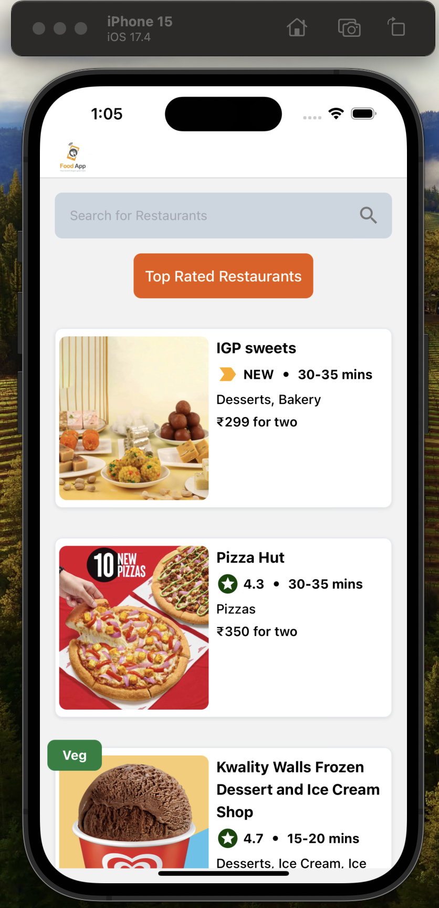
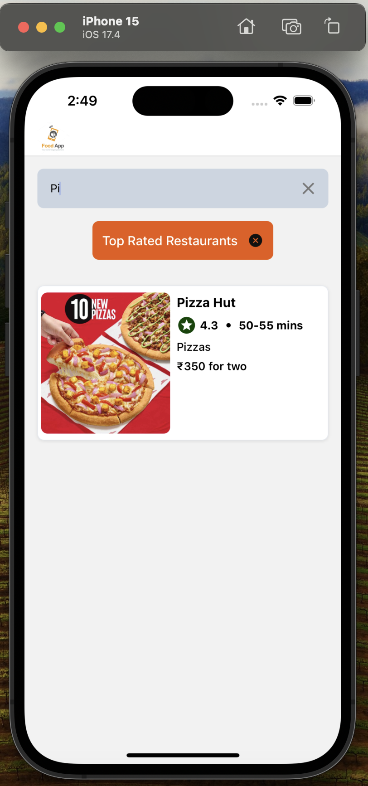
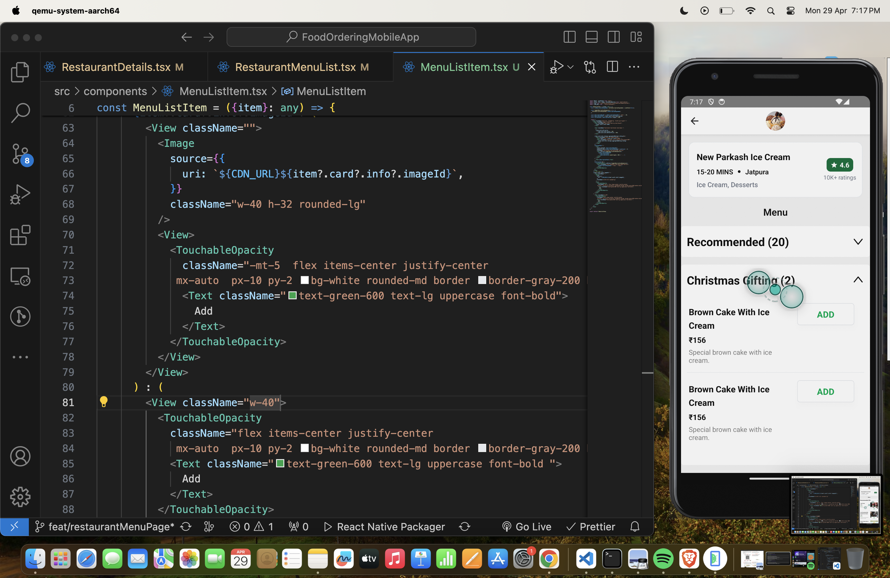
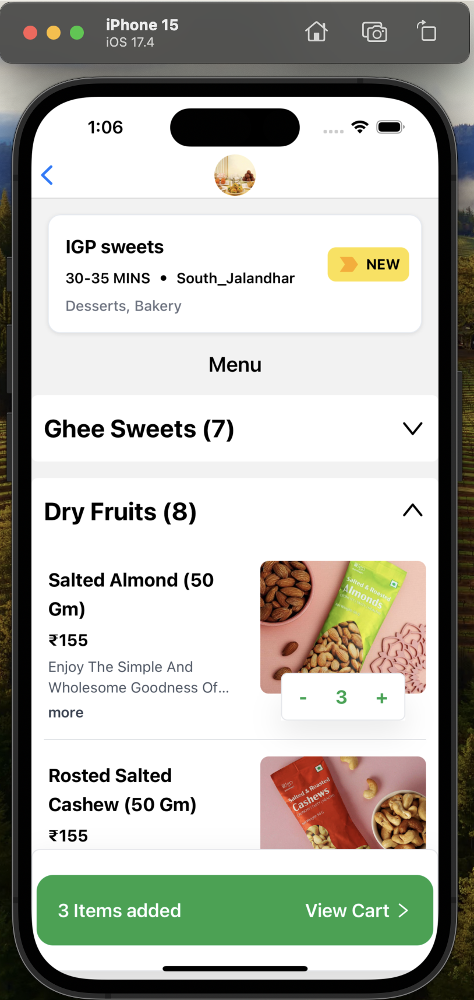
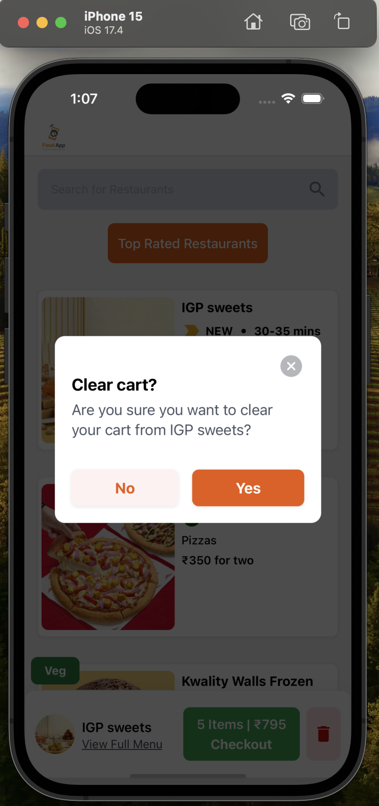
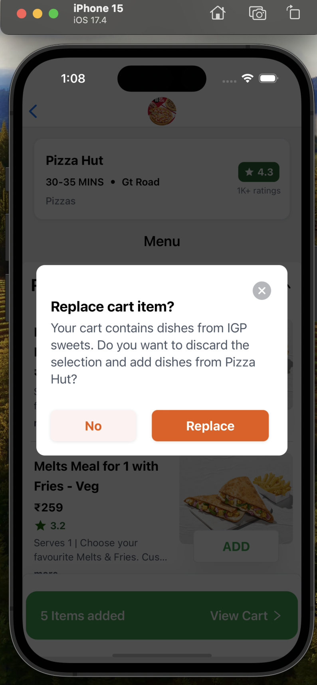

# Features

- navigation (stack)

### home page :-

- home page of all food items list
- header ( title and left and right btn )
- search bar designing
- top rated filter button designing
- Dummy flatlist of all restaurnats list on restaurnats list page
- fetching list of restaurants from api (for different platform api havign different structure)
- Shimmer UI (whole restaurant list page will be visible after restaurant list from api is being fetched)
- Search Filter list
- Top Rated Restaurants Filter list
- HOC VEG restaurant
- cuisines display in slice
- if no filtered / resList length is 0 in starting or on fitlers :- display No Restaurants Text.

### restaurant Details page :-

- fetching restaurant menu details using resId (useRestaurantMenu)
- setting up the header menu icon on top of resDetails page
- make a header type design for particular restaurant detail (resInfo card)
- Menu display (menu categories)
  - creating flatlist for each menu category with item seperator as a line
    - menu category item will be card similar as detailed header
  - that menu category list should be toggled (open and close)
  - then same as all menu categories list should be rendered
  - Restaurant Menu Page Shimmer UI

### Cart Page

- on click of Add Button in Restaurant Menu List page :-
  - Designing "1 item added" component for a particular restaurant where the add button is clicked. It should be above the scrolling Flatlist as behind that component the list should be able to get scrolled.
  - can think of adding Animation while adding item (OPTIONAL)
- On Home Page (need to show the cart items added)
  - to make the cartInfo box with different styles here also.
  - (can hide above box when scrolling down and show when scrolling up on Home Page) (OPTIONAL)
- On Home Page :- "CartDeleteModal"
- On any Restaurant's details page while selecting an item from that restaurant when cart is already there, then Show "ReplaceCartModal".
- View Cart Design
- CART FUNCTIONALITY :-
  - when click on ADD button, to console.log show res id and item name.
    console.log(resId, item?.card?.info?.name)
    ( LOG 284183 Jammu Poori, Aloo, Chana [2 Pcs])
  - item added to cart, cart header, cart items and cart footer shown.
  - All cart Info footer and cart details footer at Home and RestaurantDetails page update with cart Info
  - All cart Modals update with cart info and functionality
  - When item, gets added from Restaurant Details Page, quantity information needs to be added.
  - Place order details according to quantity of items to be updated.
  - Refactoring the code
  - updating screen recording , pics of app again
  - creating APK

## Screenshots

## Video recording till Restaurant Menu List Page

https://github.com/chandana105/food-ordering-mobile-app/assets/39641650/04200459-fbb1-4729-8259-410e8afd1efa

- TODO: FONT THEME NOT PUT TILL NOW , TO ADD IT
- TODO: onRefresh of Flatlist (to fetch new list of restaurants if user wants) (HOME PAGE)
- TODO: To show infinte number of rest's not only 10 (ie only of page1) (HOME PAGE)
